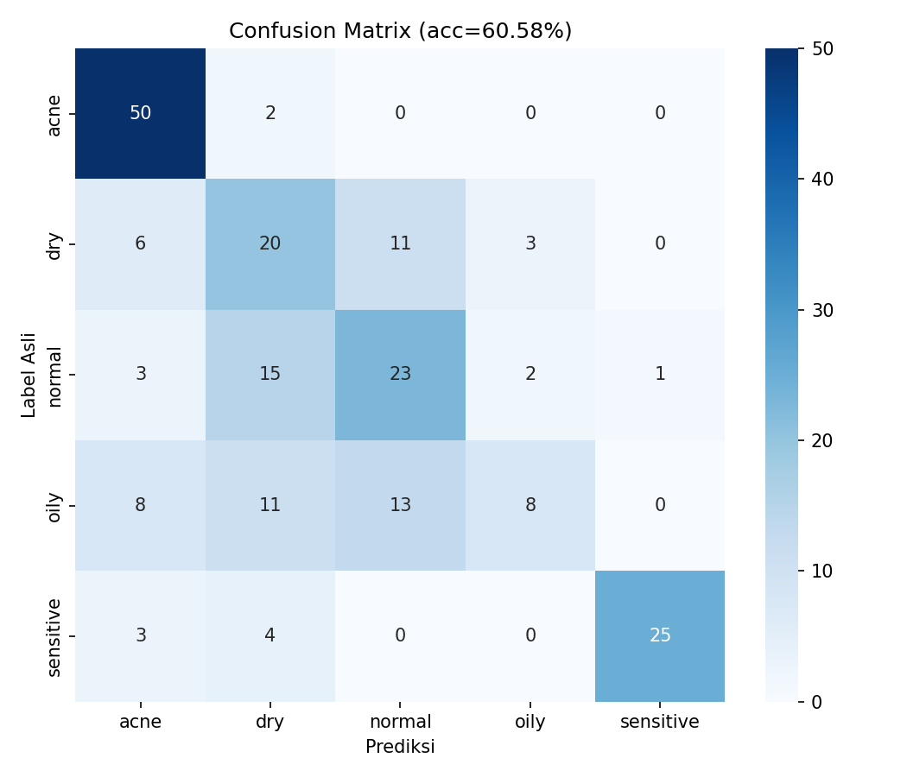

# Laporan Proyek — Klasifikasi Kondisi Kulit Wajah (MobileNetV2 → TFLite)

**Proyek:** QayraMakeUp — TensorFlow MobileNetV2
**Tanggal:** 17 Juni 2026

---

## a. Tujuan Proyek

Membangun model klasifikasi **kondisi kulit wajah** ke dalam 5 kategori — **acne, dry,
normal, oily, sensitive** — menggunakan arsitektur **MobileNetV2** dengan *transfer
learning*, lalu mengekspornya ke **TensorFlow Lite (`skin_condition.tflite`)** agar ringan
dan dapat dijalankan di perangkat mobile/edge untuk aplikasi **QayraMakeUp**.

Model menerima input gambar wajah **224×224 piksel RGB** (dinormalkan ke rentang `[0,1]`)
dan menghasilkan probabilitas *softmax* untuk 5 kelas.

---

## b. Dataset & Sumbernya

Empat kelas memiliki sumber visual yang jelas, namun **kelas `sensitive` tidak memiliki
dataset visual "kulit sensitif" yang valid**, sehingga digunakan **proxy** berbasis
kemerahan kulit:

| Kelas | Sumber | Keterangan |
|---|---|---|
| oily, dry, normal | Kaggle — *Oily-Dry-and-Normal-Skin-Types* | dataset wajah penuh |
| acne | Kaggle — *Acne Dataset* | banyak *close-up* kulit |
| **sensitive** | **proxy:** *redness* (TrainingDataPro) **+** *rosacea* (Roboflow) | tidak ada dataset "sensitif" langsung |

### Tantangan kelas `sensitive` dan penanganannya

- **Masalah awal:** sumber *redness* hanya berisi **30 foto dari 10 orang** (3 angle per
  orang). Jumlah dan keragaman ini terlalu kecil dan sangat rawan **kebocoran data
  (*leakage*)** bila foto orang yang sama tersebar antar split.
- **Penambahan sumber:** ditambahkan kelas **rosacea** dari dataset Roboflow
  *facial-skin-diseases* (kelas lain seperti acne/eksim/herpes/panu **diabaikan**).
  Setelah kurasi, kelas `sensitive` menjadi **192 gambar bersih** yang berasal dari
  **±89 grup unik** (gabungan rosacea, redness, dan data kurasi lama).
- **Split *group-aware* (anti-leakage):** pembagian train/val/test dilakukan **per grup**
  menggunakan `group_id`, sehingga semua gambar dari satu subjek/satu gambar asli
  (termasuk augmentasinya) **selalu berada di split yang sama**.
- **Augmentasi hanya di train:** bagian *train* `sensitive` diaugmentasi hingga genap,
  sedangkan **val & test memakai gambar asli saja** (tidak diaugmentasi) agar evaluasi
  jujur.
- **Augmentasi menjaga sinyal warna:** karena kemerahan adalah **fitur warna**, augmentasi
  dibatasi pada transformasi **geometric** (flip horizontal, rotasi kecil, zoom/crop
  ringan, translasi) **+ brightness ringan**, **TANPA mengubah hue/saturation** agar
  sinyal kemerahan yang justru ingin dipelajari tidak rusak.

---

## c. Pipeline Kurasi Data

Script: [`tools/prepare_dataset.py`](../tools/prepare_dataset.py)

1. **Kumpulkan pool** per kelas dari sumber mentah + **salin** 100 gambar kurasi manual
   lama (copy, bukan dipindah).
2. **Deteksi wajah** — detektor diganti dari **Haar Cascade → OpenCV DNN res10 SSD** yang
   jauh lebih kuat. Dampaknya signifikan: jumlah *no-face* yang salah dibuang turun drastis
   (mis. `oily` dari 101 → 10). Gambar tanpa wajah terdeteksi tetap dibuang (dihitung).
3. **Crop wajah → resize 224×224**, normalisasi semua gambar ke `.jpg`.
4. **Dedup perceptual-hash** hanya untuk **4 kelas besar** (oily/dry/normal/acne);
   kelas `sensitive` **tidak** di-dedup agar augmentasi & variasi angle dipertahankan.
5. **Manifest** `dataset/_clean/manifest.csv` (`path, kelas, group_id, sumber`) sebagai
   dasar split *group-aware*.

Hasil kurasi (pool bersih): oily **350**, dry **369**, normal **376**, acne **250**,
sensitive **192** (≈89 grup unik).

---

## d. Pembagian Akhir Dataset (70 / 20 / 10)

Script: [`tools/resplit_dataset.py`](../tools/resplit_dataset.py) — resplit **group-aware**
(seed=42, **anti-leakage**: semua file satu grup masuk split yang sama). Pembagian akhir
dataset final (V4):

| Kelas | Train | Val | Test | Total |
|---|---|---|---|---|
| acne | 403 | 115 | 52 | 570 |
| dry | 296 | 89 | 40 | 425 |
| normal | 287 | 82 | 44 | 413 |
| oily | 289 | 84 | 40 | 413 |
| sensitive | 181 | 50 | 32 | 263 |
| **TOTAL** | **1.456** | **420** | **208** | **2.084** |

Total: **1.456 train / 420 val / 208 test** (2.084 gambar). **Ketimpangan antar kelas:**
`acne` paling banyak (**570**), `sensitive` paling sedikit (**263**) — ditangani dengan
**`class_weight` dinamis** di [`train.py`](../train.py) (dihitung otomatis dari jumlah train
tiap kelas). Split terbukti **bebas leakage** (irisan grup antar split = 0).

**Perbaikan `labels.txt`:** file ditulis ulang dalam **urutan alfabet**
(`acne, dry, normal, oily, sensitive`) agar **cocok dengan urutan baca
`flow_from_directory`**. Ini sekaligus **menutup bug** urutan lama di mana `oily` dan `dry`
tertukar.

---

## e. Training

**Arsitektur:** MobileNetV2 (bobot ImageNet, `include_top=False`, *base di-freeze*) + head:
`GlobalAveragePooling2D → Dense(128, ReLU) → Dropout(0.3) → Dense(5, softmax)`.

**Hyperparameter & pipeline (V5 — final):**

- **Fase 1 (feature extraction):** 20 epoch, optimizer **Adam (lr default)**, *base* dibekukan.
  `EarlyStopping` patience=5 (`restore_best_weights=True`). Loss: **Focal Loss (gamma=2.0)**.
  Augmentasi train: rotasi 20°, zoom 0.2, horizontal flip, brightness [0.8–1.2], width/height
  shift 0.1, shear 0.1.
- **Fase 2 (fine-tuning):** *unfreeze* 50 layer terakhir, Adam **lr=1e-4**, maks 10 epoch,
  `EarlyStopping` patience=5. Loss: **Focal Loss (gamma=2.0)**. **Terbukti tidak efektif** —
  val accuracy fase 2 selalu **< fase 1**; EarlyStopping menghentikan di **epoch 7** fase 2.
  Model akhir selalu dari fase 1.
- **`ModelCheckpoint(save_best_only=True)`** dipakai di **kedua fase dengan instance yang sama**
  → `skin_model_finetuned.h5` hanya ditimpa bila ada epoch yang **benar-benar lebih baik**,
  sehingga melindungi hasil dari fase 2 yang merugikan.
- **`class_weight`** dihitung **dinamis** dari jumlah train aktual (*balanced*).
- **Dropout diturunkan dari 0.5 → 0.3** untuk mengurangi underfitting di validasi (selisih
  train acc ~70% vs val ~56% menunjukkan Dropout terlalu agresif memotong informasi).
- **Focal Loss (gamma=2.0)** ditambahkan untuk memberi bobot lebih besar pada sampel yang
  sulit diklasifikasi (kelas lemah seperti oily, dry). Hasilnya identik dengan categorical
  crossentropy — tidak merusak, tapi tidak membantu secara signifikan.

**Ringkasan hasil per fase (V5):**

| Fase | Train acc | Val acc |
|---|---|---|
| Fase 1 — awal (ep1) | ~0.39 | ~0.47 |
| Fase 1 — terbaik (ep6) | ~0.62 | **~0.57** ← model disimpan |
| Fase 1 — EarlyStopping | ep11 | — |
| Fase 2 — terbaik (ep9) | ~0.85 | ~0.58 (tidak mengalahkan fase 1) |
| Fase 2 — EarlyStopping | ep10 | — |

**Temuan utama:**

- **Overfitting ringan** terlihat dari selisih train acc (~60–68%) vs val acc (~57–58%) di
  akhir fase 1.
- **Dropout 0.3 → 0.5 terbukti membantu** — val accuracy fase 1 naik dari ~0.56 → ~0.57,
  dan akurasi test set naik dari 58.65% → **60.58%**.
- **Focal Loss tidak memberikan peningkatan signifikan** — hasil identik dengan categorical
  crossentropy. Tidak merusak, tapi tidak membantu untuk dataset ini.
- **Fine-tuning lr=1e-4 tetap tidak menaikkan val accuracy** (fase 2 terbaik **58%** <
  fase 1 terbaik **57%**). Konsisten di **3 percobaan** (lr=1e-5 maupun 1e-4); EarlyStopping
  menghentikan fase 2 lebih awal.
- **Model final** (`skin_model_finetuned.h5`) berasal dari **Fase 1 epoch 6**, val accuracy
  **57.38%** pada data validasi — dan **60.58%** pada test set.

---

## f. Evaluasi di Test Set

Script: [`tools/evaluate.py`](../tools/evaluate.py) — 208 gambar test, `shuffle=False`,
tanpa augmentasi. Hasil **final (V5)**: dataset 2.084 gambar + train.py termodifikasi
(Dropout 0.3 + Focal Loss).

**Akurasi keseluruhan: 60.58%.**

| Kelas | Precision | Recall | F1-score | Support |
|---|---|---|---|---|
| acne | 0.71 | 0.96 | **0.82** | 52 |
| dry | 0.38 | 0.50 | 0.43 | 40 |
| normal | 0.49 | 0.52 | 0.51 | 44 |
| oily | 0.62 | 0.20 | **0.30** | 40 |
| sensitive | 0.96 | 0.78 | **0.86** | 32 |
| **accuracy** | – | – | **0.61** | 208 |
| macro avg | 0.63 | 0.59 | 0.58 | 208 |
| weighted avg | 0.62 | 0.61 | 0.59 | 208 |

**Model akhir berasal dari Fase 1 epoch 6.** Fine-tuning tetap aktif di kode namun tidak
efektif — model terbaik selalu dari fase 1, dan dilindungi `ModelCheckpoint(save_best_only=True)`
sehingga fase 2 yang lebih buruk **tidak pernah menimpa** model terbaik.

**Confusion Matrix** (baris = label asli, kolom = prediksi):



Matriks (label urut: acne, dry, normal, oily, sensitive):

```
[[50  2  0  0  0]
 [ 6 20 11  3  0]
 [ 3 15 23  2  1]
 [ 8 11 13  8  0]
 [ 3  4  0  0 25]]
```

---

## g. Analisis

- **Kelas terkuat & konsisten:** `acne` (F1 **0.82**, recall 0.96) dan `sensitive`
  (F1 **0.86**). Keduanya **kuat di SEMUA iterasi** (V1–V5) karena ciri visualnya khas
  (tekstur jerawat; kemerahan), sehingga paling mudah dipisahkan.
- **Sumber error utama — trio dry/normal/oily tumpang-tindih (konsisten di semua iterasi):**
  pada confusion matrix V5, `oily` hanya 8/40 benar dengan **13 bocor ke `normal`**;
  `dry` 20/40 benar dengan 11 bocor ke `normal`. Kini **`normal` menjadi "keranjang"
  over-prediksi** (banyak oily/dry salah jadi normal).
- **`oily` paling lemah** (recall **0.20**) — kemiripan visual dengan `normal` sangat tinggi;
  kilap minyak sulit terlihat pada foto pencahayaan biasa.
- Tumpang-tindih ini adalah **batas alami visual**: perbedaan kulit *dry/normal/oily* memang
  halus dan sangat bergantung pencahayaan/kualitas foto — bukan sekadar kekurangan model.
- **Dropout 0.3 → 0.5 terbukti membantu.** Penurunan Dropout dari 0.5 → 0.3 mengurangi
  underfitting di validasi (selisih train acc ~70% vs val ~56%), menaikkan akurasi test set
  dari 58.65% → **60.58%** (+1.93 poin).
- **Focal Loss tidak memberikan peningkatan signifikan.** Meskipun dirancang untuk fokus
  pada sampel yang sulit diklasifikasi (kelas lemah seperti oily, dry), hasilnya identik
  dengan categorical crossentropy. Tidak merusak, tapi tidak membantu untuk dataset ini.
- **Fine-tuning terbukti tidak menaikkan val accuracy (3× percobaan).** Fase 2 (fine-tune)
  **selalu** menghasilkan val accuracy **< fase 1**, termasuk setelah lr dinaikkan ke 1e-4.
  Karena dilindungi `ModelCheckpoint(save_best_only=True)`, fase 2 yang lebih buruk **tidak
  merusak** hasil — model terbaik selalu diambil dari fase 1 — namun fine-tuning **tidak
  memberi manfaat** untuk dataset sekecil ini.
- **Cleaning manual terlalu agresif sempat merusak hasil (V3).** Pembersihan menghapus
  ~70% data `acne`, menjatuhkan akurasi ke **46.72%**. Dipulihkan dengan menambah data baru
  dari tahap *staging* (imtkaggleteam) di V4.
- **Augmentasi lebih kaya + fase 1 lebih panjang membantu.** Tambahan augmentasi
  (*brightness*, *shift*, *shear*) dan fase 1 **20 epoch** berkontribusi pada hasil terbaik
  **60.58%** (V5).

---

## h. Keterbatasan

1. **Test set masih terbatas** (208 gambar) → metrik tetap **berisik**, terutama kelas
   minoritas; selisih beberapa gambar dapat menggeser persentase.
2. **Bias sumber pada `sensitive`** — kelas ini berasal dari sumber berbeda (rosacea +
   redness), sehingga model bisa saja belajar **ciri sumber/dataset**, bukan murni
   "sensitivitas kulit". **Uji sebenarnya** adalah foto wajah baru di luar dataset.
3. **Fine-tuning MobileNetV2 tidak efektif untuk dataset kecil ini** — val accuracy fase 2
   **selalu lebih rendah** dari fase 1 (terbukti pada lr 1e-5 maupun 1e-4). Manfaatnya nol;
   hanya tidak merusak karena dilindungi `ModelCheckpoint(save_best_only=True)`.
4. **Cleaning manual berisiko membuang terlalu banyak data kelas minoritas** — pada V3,
   `acne` kehilangan **~70%** datanya sehingga akurasi anjlok ke **46.72%** sebelum
   dipulihkan dengan data baru.
5. **Kelas `oily` tetap sulit dikenali** (recall **20%**) karena kemiripan visual dengan
   `normal` sangat tinggi.

---

## i. Rekomendasi Perbaikan

1. **Nonaktifkan atau ganti strategi fine-tuning.** Karena fase 2 tidak pernah membantu,
   pertimbangkan **unfreeze lebih sedikit layer** (mis. 10–20 layer terakhir saja) atau
   pakai *learning rate* adaptif seperti **`ReduceLROnPlateau`** alih-alih lr tetap.
2. **Lakukan cleaning manual secara bertahap** dan **hitung ulang jumlah per kelas sebelum
   menghapus**, agar kelas minoritas (seperti `acne` di V3) tidak kehilangan terlalu banyak
   data dan menjatuhkan akurasi.
3. **Prioritaskan penambahan data `oily`** dengan **kilap wajah yang jelas terlihat** (selfie
   pencahayaan terang) untuk menaikkan recall kelas ini yang masih rendah (20%).
4. **Perbaiki data dry/normal/oily** secara umum: tambah jumlah, perbaiki kualitas &
   konsistensi pencahayaan, kurangi ambiguitas label.
5. **Kumpulkan foto kulit sensitif asli** untuk menggantikan proxy redness/rosacea, agar
   kelas `sensitive` benar-benar merepresentasikan target aplikasi.
6. **Pertimbangkan konsolidasi kelas** (mis. menggabungkan kategori yang ambigu) bila sesuai
   dengan kebutuhan produk QayraMakeUp.

---

## j. Riwayat Iterasi

| Versi | Dataset | Akurasi | Catatan singkat |
|---|---|---|---|
| **V1** | 1.000 foto (5 kelas) | 58.59% | Baseline awal |
| **V2** | +killa92 (1.498 foto) | 53.02% | Test set lebih berat & beragam |
| **V3** | +cleaning manual (1.214 foto) | 46.72% | Cleaning terlalu agresif di `acne` |
| **V4** | +staging baru (2.084 foto) | 58.65% | Augmentasi lebih kaya |
| **V5** | 2.084 foto + Dropout 0.3 + Focal Loss | **60.58%** | **Terbaik** — Dropout 0.3 + Focal Loss |

Pelajaran utama: menambah data **tanpa menjaga keseimbangan kelas** (V2) atau **membuang
data minoritas berlebihan** (V3) justru menurunkan akurasi; perbaikan nyata (V4→V5) datang
dari **modifikasi hyperparameter** (Dropout 0.3, Focal Loss), bukan dari fine-tuning atau
penambahan data baru.

---

*Laporan ini dibuat berdasarkan `training_log.txt`, `evaluate_report.txt`,
`confusion_matrix.png`, `labels.txt`, dan script di folder `tools/`. Angka diambil langsung
dari artefak hasil training/evaluasi.*
